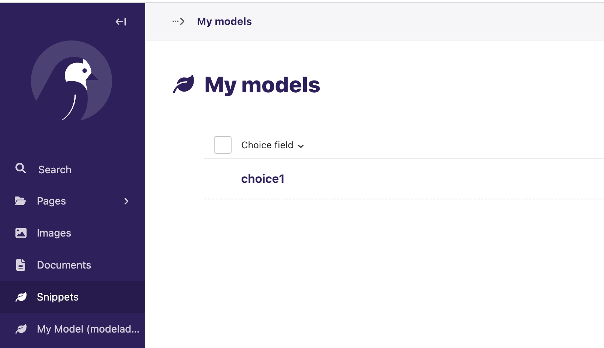
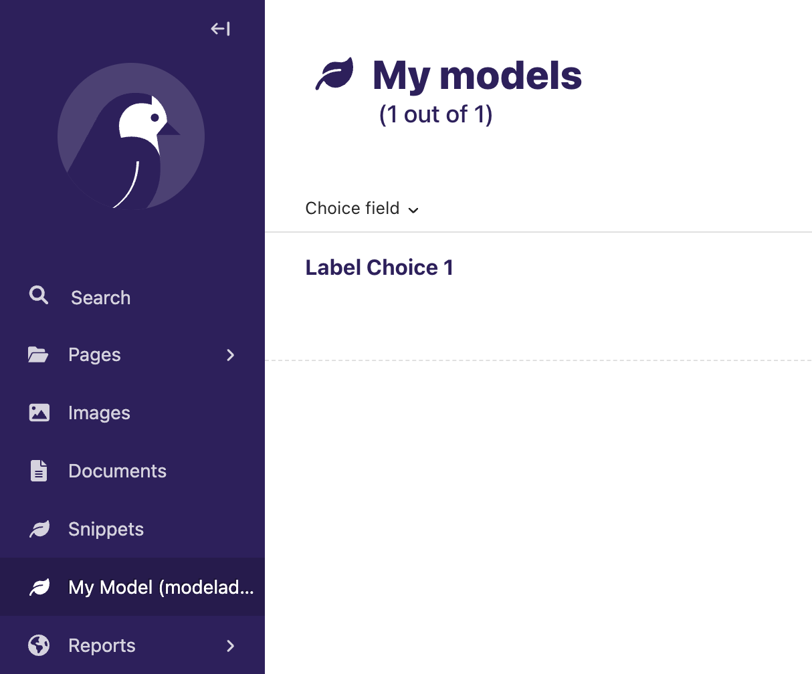

# Wagtail issue 10815 demo

This is a demo project for [Wagtail issue #10815](https://github.com/wagtail/wagtail/issues/10815).

## How to reproduce

1. Clone this repo
2. Create a virtualenv and install the requirements: `pip install -r requirements.txt`
3. Run `./manage.py migrate`
4. Run `./manage.py createsuperuser`
5. Run `./manage.py runserver`
6. Add a new MyModel object in the admin: http://127.0.0.1:8000/admin/snippets/home/mymodel/add/
7. Check the MyModel snippet listing http://127.0.0.1:8000/admin/snippets/home/mymodel/
8. Compare with the ModelAdmin version: http://127.0.0.1:8000/admin/home/mymodel/

## Actual behavior

The snippet listing is displaying the raw value stored in the database `choice_field`, not the display value that should be associated with that value.

The model admin is displaying the display value, which is the correct behavior.

## Expected behavior

The snippet listing should display the display value, not the raw value. No extra code should be necessary to achieve this.
